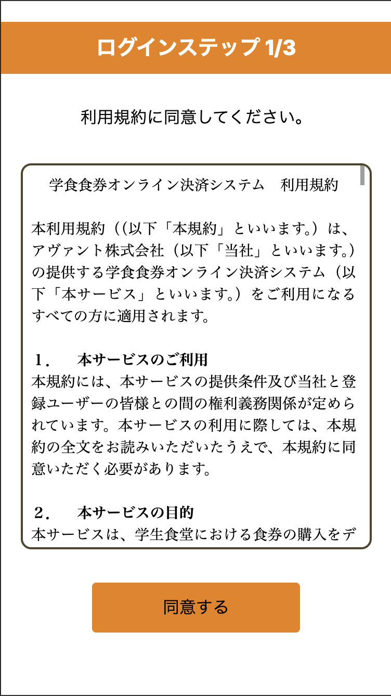
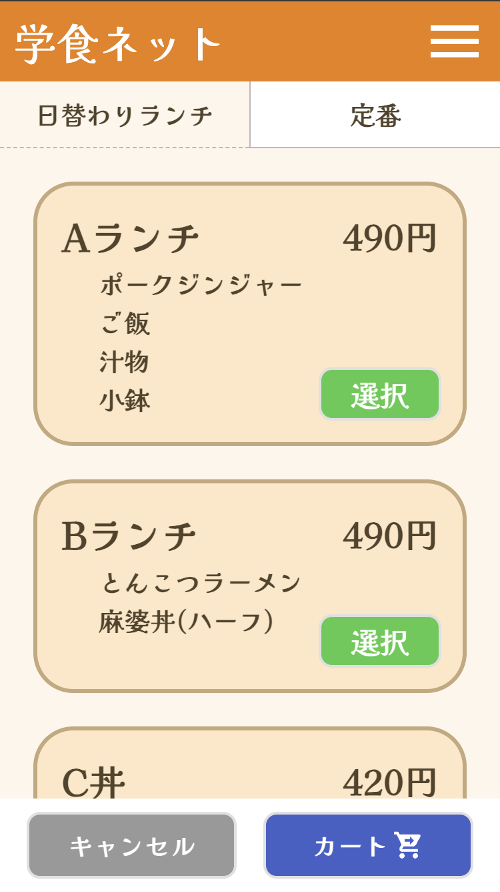
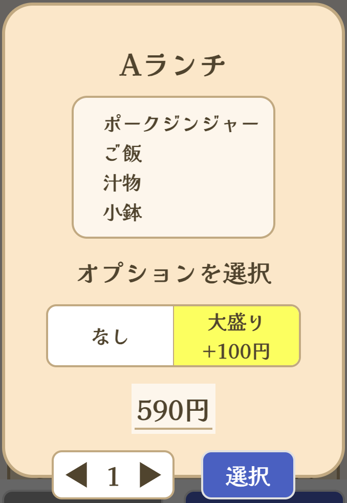
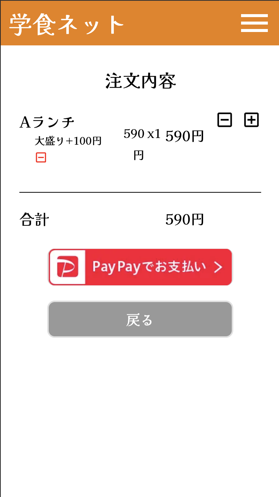
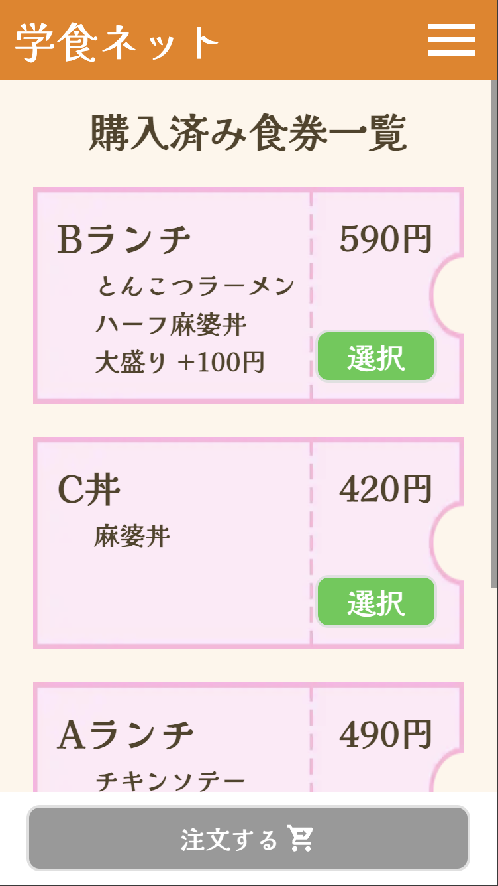

# 学食を PayPay で買えるようにしてみた話

## はじめに

去年の夏休み開け（2024 年 9 月）に弊高に新しく食堂ができました。ただ、対応している決済方法が、現金と Suica だけで、さらに、券売機が 2 つしかなく、よく混雑していました。そこでとある高 3 の先輩がこれをどうにか改善できないかと考え、今年の 3 月上旬にモバイルアプリで食堂の食券を買えるサービスを作ろうというプロジェクトを立ち上げ、私もそれに参加しました。

そして、それがこの夏休み中で完成し、2 学期から本格稼働するので、この記事を書き上げました。

最初は、モバイルアプリで作ろうという計画でしたが、Android と iOS の両方に対応するのはあまりにも難しかったので、結局 3 月にウェブアプリに方向転換しました。

この記事では、今年の 3 月下旬から作り始めたこのウェブサイトについて書きます。

作成段階では、手数料の交渉や、運営をしてくださる会社探しなどの、プロジェクトマネジメントに関することもたくさんありましたが、この記事では主に技術的な面だけについて触れていきます。

ちなみに、サービス名はつい最近（8 月中旬くらい）に決まったのですが、「学食ネット」です。URL も名前の通り https://gakushoku.net です。開成高校の生徒と開発者以外はログインできないのでみることはできないですが、ランディングページ（ https://gakushoku.net/landing ）は見ることができます。

## 実際のアプリの紹介

実際のアプリはこんな感じです。

まず、ログインページでいつも通りのとても長い利用規約を読まされます。

ログインをすると、利用案内ページが開き、動画での利用方法の説明を見ることができます。

注文する時はメニューページを開きます。メニューページでは、日替わりメニューと定番メニューに分かれていて、タブで切り替えることができます。

メニューを選択すると、このようなモーダルが表示され、オプションを選択することもできます。

カートを開くと、このように選択した内容を見ることができ、編集することもできます。購入すると決めたら、「PayPay でお支払い」ボタンを押して、 PayPay アプリに遷移し、決済をすることができます。

決済が完了すると、購入した食券一覧が表示されます。

食堂の配膳の列に並んだら、注文したい食券を選択し、注文ボタンを押すことで、このような食券画面が表示され、これを調理師の方に見せることで作ってくれます。

そして、料理を受け取って「受け取り済み」ボタンを押して完了です。

## 技術・サービス選定

さて、ウェブサイトを作っていく際には、まずは技術選定と、それに準じてホスティングサービス（サーバー）などを決めていく必要があります。

### TL;DR（要約）

TypeScript + Next.js + SCSS + Prisma + Vercel + Supabase

途中で Tailwind CSS も導入。

### 技術選定

まず、ウェブサイトの根幹な部分ですが、これはすぐに決まりました。今一番アツいと言っても過言ではない React + Next.js (App Router) です。また、 TypeScript を採用しました。

そして、今回はこれに加え、 SCSS と Prisma を導入しました。

SCSS を導入した理由は、スタイルをネストして書けるのがとてもよく、また、 Next.js の開発環境ではファイルを保存したら自動でビルドしてくれるのでとても相性もいいと思ったからです。（この判断が誤りであると気づき、 Tailwind CSS を導入するのはまた後のお話。）

Prisma を導入した理由は、データベースはリレーショナルデータベースかつ、それを ORM （データベースを JS のクラスとして操作できて、 SQL を書く必要がなくなるもの）で操作したかったからです。そして、 Prisma が JavaScript の ORM として一番有名と言っても過言ではないので Prisma にしました。

### サービス選定

技術選定ができたら、次にサービス選定を行います。自分でサーバーを立てるなら必要ないですが、今回はその費用がないので、無料のホスティングサービスなどを使って運用する必要があったのでサービス選定をする必要がありました。

#### ホスティングサービス

これがないとウェブサイトを公開でません。

ウェブサイトのホスティングは Next.js と相性が最も良い Vercel にしました。無料かつ、特に必要な設定は少なく、すぐに公開できてとても良いです。

#### データベース

ウェブアプリといえばデータベースです。買った食券やメニューをどこかに保存しておく必要があります。

データベースは Supabase にしました。Supabase は、データベース機能の他にもストレージ機能や、今回は使わなかったのですが、認証機能などもあり、しかも無料で使用できるのでアプリ開発などにとても良いです。実際、このアプリでも後半ではデータベース機能だけでなくストレージ機能も使用しています。

また Supabase にしたもう一つの理由は、リレーショナルデータベースであるからです。 Supabase と同じようなサービスとして Firebase という選択肢も当初はありましたが、あちらは非リレーショナルデータベース（NoSQL）で、データの整合性を保証しづらいので、今回のような決済を含むアプリケーションには不向きと判断し、使いませんでした。

#### git + GitHub

そして git と GitHub です。プログラムを保存でき、バージョン管理もでき、共同作業もできるようにする必須アイテムです。 Vercel も GitHub と連携し、プッシュされたら自動でデプロイするようにしました。

#### 後日談

PayPay の API を使用するにあたり、 IP アドレスを固定する必要があり、 Vercel は IP アドレスが変わってしまうので、ホスティングサービスは結局 AWS に移行しました。

具体的には、 Elastic Beanstalk でデプロイなどをし、 CloudWatch でログを確認、その他 VPC や WEB サイト証明書などの諸々で構築しています。

## 気づき

実際の開発内容などは長すぎるので省略します。ここでは、主に開発中に起きた興味深いことだけを紹介します。

### Tailwind CSS の方が良かった

今回のプロジェクトに限らず、今まで Next.js でウェブサイトを作るときはずっと SCSS を使ってきました。なぜなら、前述の通り、ネストして書くことができて、毎回コンパイルしてくれる Next.js と相性がいいからです。

また、 Tailwind CSS を使わなかった理由も明確にあり、理由としてはスタイルの class を定義できないから、スタイルのまとまりを作ることができないというのと、同じスタイルだった場合でも流用することができず、コードが冗長になると思ったからです。

ですが、今回のプロジェクトを通して、プロジェクトが大きい場合は SCSS は可読性を著しく低下させることに気づきました。また、これはコンポーネント分けにも関わってくる話です。

#### 問題

具体的に起きたこととしては、例えば、食券の CSS です。

最初はメニューページの食券の CSS のために、 menuCard.module.scss がありました。

次に、メニュー編集ページにも、メニュー編集ページ用の食券を作りました。内容はメニューの食券とは違うものの、レイアウトや大きさは同じなので、こちらも menuCard.module.scss を流用しました。ただ、開発している途中で、やはりそのまま適用するわけにもいかないので、 cafeteriaMenuCard.module.scss という編集ページ専用のスタイルを追加で適用しました。

また、今度は購入済みチケット一覧ページにも menuCard.module.scss を適用しました。これも例の如く、やはり変更が必要だったのですが、編集ページほどではないので、 menuCard.module.scss に少し追記をしました。

さらに、実は一番最初にメニューページの食券を作るときに、食券の幅は menuCard.module.scss ではなく、 menu.module.scss という食券のコンテナの CSS を定義するファイルに記述していました。

また、ここに限らず、他のところでも同じようなことが発生しています。

ここで、ウェブサイトを作ったことがある方ならわかると思いますが、この状態で、例えば編集ページのレイアウトを少し編集したい、となったときに、まずは何個もの tsx ファイルと scss ファイルを開いて、どこを編集すべきかを探す作業が必要になり、これがまあまあ面倒なわけです。

#### Tailwind CSS なら

さて、もしもここで Tailwind を使った場合を考えてみます。スタイルは className にそのまま書かれているので、 scss ファイルが大量にできて、わざわざ開いて確認する必要があるということが発生しません。

また、同じスタイルの部分は、正直に言えばコピペして冗長にした方がよっぽどマシです。複数のファイルに分かれた大量の css の中から変更したい箇所を探すよりは、そのまま変更したい箇所の className を変更する方がよっぽどミスと時間ロスが減ります。そもそも、コンポーネントを細かく分けるという方法によってなら Tailwind を使い回すことも可能で、これはスタイルの面だけでなく Next.js の根本的な目的の観点からも良い書き方であると言えます。

#### これを通して考えた最も良い書き方

ここまで話してきましたが、 Tailwind も万能ではありません。 animation などはやはり JS あるいは css で書く必要があります。よって、私は以下のようなルールで書くことがいいと結論づけました。

1. 全てのスタイルは原則 Tailwind CSS。
<!-- 2. TODO: template がないか調べる -->
2. 使いまわしたい場合はコンポーネントに分ける。
3. css は最終手段。

### お金の処理はとても精神をすり減らす

今回のプロジェクトは、僕が今まで作ってきたウェブサイトとは何よりも違う点がありました。リアルマネーが絡むという点です。

リアルマネーが絡むということは、人のお金がこのウェブサイト上で流通するということです。つまり、どこかにバグがあれば、人のお金が消えたり増えたりしてしまいます。もしこんなことが起きてしまったら笑い事じゃないです。最悪、その日のうちに新聞になります。

正直、開発しているときは、本当にこの実装でいいのか、本当にこの実装でエラーはバグが発生しないのか、他に何かエラーやバグの原因になりえないか、ということを一生考えていて気が気じゃなかったです。なぜ世の中の人はウェブサイトなんかでお金のやり取りをしようとしたのかを疑ったりもしました。（実際ハッキングや、ミスで個人情報漏洩や金銭のトラブルは発生しています。）

今回、特に~~検討に検討を重ね~~労力がかかったのは、食券の流用防止と返金処理です。

#### 食券の流用防止

ここは開成です。生徒が何するかわかったものではないです。

食券の流用防止にはあらゆる策を練りに練って~~結局部分的に妥協して~~以下のような方針になりました。

1. タイマーを表示し、動いていないといけないのでスクショ対策。
2. 5 分間の時間制限を設け、2 回並ぶことを防ぐ。
3. 終了時刻を年月日時分秒まで表示し、動画も対策。

と入っても、調理師さんが毎回毎回現在時刻を確認したりするのは不可能なので、ここは妥協しました。正直紙の食券でも色々脆弱性はあるのであまり変わらないという結論を下しました。

また、想定している中で最も怖い事例は、ウェブサイトをコピーして、全く同じ画面を表示してくることです。こんなのはもはや対策しようがないので諦めました。そもそもここまでしてやる人は IT リテラシーも十分高いはずです。

※実はこの記事を一通り描き終えた後に、やはりこれではまだイカサマをされる可能性があるということが判明し、さらに手を加えています。

#### 返金処理

返金処理もとても悩みました。最初の段階では、返金申請というのを生徒ができるようにし、申請をしたら id が発行され、調理師の人に見せたら返金を実行するという流れを想定していましたが、調理師さんはそこまで余裕がないのと、生徒がふざけて返金したら溜まったものではないです。

いろいろな案を考えた結果、最終的には当日の夜に自動返金という結論に至りました。また、1 日の食券購入枚数も 5 枚まで制限しました。こうすることによって、調理師の方々への負担も減り、すぐに返金できないのでふざける生徒も出てこないだろうという考えです。

ちなみに、定期実行の実装には少々苦労しました。 Vercel のプランの問題だったりいろいろ壁がありましたが、最終的には AWS で統一したので解決しました。

#### 余談

夏休み明け最初の週に、実際に本番環境でテストを行いましたが、何度たまたまタイミング良く(?)、1 回の決済で 2 回分の食券が購入できてしまう（アプリ側で決済が 2 回実行されてしまう）事件が発生してしまいました。

詳しい内容は割愛しますが、これはたまたま 1 分ごとのシステム側の決済チェックと、実際の決済が重なって起きたもので、約 0.1 秒以内の誤差で発生するものでした。

これにはど肝を抜かされましたが、なんとか修正できました。本番前に発見できて本当によかったです。

## 最後に

開発費や AWS などのホスティング費用はどこから？世の中には知らない方が良いこともありまして...
